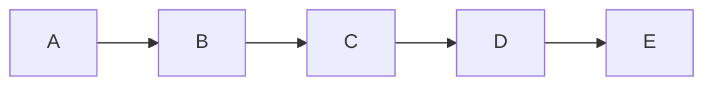

# 飞扬研发第一次例会

四川大学飞扬俱乐部

<div class="absolute bottom-10">
  <span class="font-400">
    胡宗尧 2023.11.5
  </span>
</div>


---
layout: quote
title: \.
---

# Part0. 目录

<Toc maxDepth="1"></Toc>

---
layout: quote
---

# Part1. Python 光速入门

> 写在前面：只是带你过一遍 python 的基础语法，目的就是为了让每个读者看完以后，都有能力**安装并使用第三方模块**，从而快速获得写 python 的快感，大大降低学习曲线。
> <br>
> <br>
> 建议「**先快速上手，找个好玩的东西做，然后再考虑往深里学**」。比如我这篇教程好多都是照搬[廖雪峰的python教程](https://www.liaoxuefeng.com/wiki/1016959663602400)的内容，讲的真的很好，但是这一系列文章没有几个礼拜你啃不完啊，等你啃完了，学习的热情早就没了。

---
layout: two-cols-header
---

## 0. 安装 python 与开发环境推荐

### 0.1. 安装 python

python 的安装非常简单，只需要两步：

<div grid="~ cols-2 gap-2" m="-t-2">

> **第一步**：<br>
> 在[官网](https://www.python.org/)下载最新的 python 安装包，安装时一定记得勾选`Add Python3.11 to PATH`

> **第二步**：
> 菜单栏里打开命令提示符，输入 python 后回车，如果出现 `>>>` ，即所谓的「**python 解释器**」或者「**python 交互环境**」，则可视为安装成功。


</div>

---
layout: two-cols-header
---

### 0.2. 开发环境配置

**请不要用Word和Windows的记事本。Word 保存的不是纯文本文件；记事本没有代码高亮，连IDLE都不如**

::left::

- 微软出品的[Visual Studio Code](https://code.visualstudio.com/)：最火的编辑器，没有之一，开源免费。


::right::

- 高颜值的[Sublime Text4](http://www.sublimetext.com/)：同样跨平台，比 vscode 启动更快，缺点是不开源。


---
transition: slide-up
layout: two-cols-header
---

## 1. Python 是什么？

::left::

- **写起来优雅、快速**：完成同一个任务，C 语言要写 1000 行代码，Java 只需要写 100 行，而 Python 可能只要 20 行。
- **解释性语言**：运行起来很慢
- **丰富的第三方模块**：开源社区非常活跃，贡献了很多强大的第三方库

python 解释器中的 python 语句是一行一行的：

```python {1-2|3-4|5}
>>> print("hello world!")
hello world!
>>> print(100+200)
300
>>>
```

::right::

*C语言*

```c
#include <stdio.h>
int main()
{
   printf("Hello World!");
   return 0;
}
```

*Java*

```java
public class HelloWorld {
    public static void main(String[] args) {
        System.out.println("Hello World!");
    }
}
```

*python*

```python
print("Hello World!")
```

---
layout: default
---

## 1.1. 解释性语言

<br>

> 意味着你的`.py`文件中的代码在执行时会一行一行地翻译成 CPU 能理解的机器码，这个翻译过程非常耗时，所以很慢。而 C 程序是运行前直接编译成 CPU 能执行的机器码，所以非常快。

<br>

> 此外，运行`.py`文件和在 Python 交互式环境下直接运行 Python 代码一点点不同。Python 交互式环境会把每一行 Python 代码的结果自动打印出来，但是，直接运行 Python 代码却不会。

但是，看在开发 python 如此舒适的分上，运行慢一点完全可以接受啊。


---
layout: two-cols-header
---

## 2. 基本语法详解

“#”是注释的意思，它后面的文字会被 Python 忽略。

::left::

### 2.0. 变量

```python {1-6|7-20}
>>> a = 100
>>> b = 3.1415926
>>> c = "一串字符串，里面可以是任意文本"
>>> a + b # 103.1415926
>>> a = 10 # a的值可以改变
>>> a + b # 13.1415926
>>> # python 强大的计算能力：
>>> a = -8080
>>> b = 1.234e9
>>> b
1234000000.0
>>> 2**100 # 2的100次方
1267650600228229401496703205376
>>> b**0.5 # 对b开根
35128.33614050059
>>> a + b
1233991920.0
>>> b/a
-152722.77227722772
>>>
```

::right::

那么如果我想让 c 的内容是`"hello"`怎么办？注意到 c 头尾两个字符是 python 默认「定义字符串」用的双引号，难道这样写吗？

```python
>>> c = ""hello""
  File "<stdin>", line 1
    c = ""hello""
          ^^^^^
SyntaxError: invalid syntax
```

- 包裹字符串的双引号可以换成单引号，这样就没有歧义了：`c = '"hello"'`
- 使用转义字符 `\`

```python
>>> c = "\"hello\""
>>> c
'"hello"'
```

---

### 2.1. 转义字符对照表

| 转义字符 | 意义                   | ASCII |
| -------- | ---------------------- | ----- |
| `\0`     | 空字符(NUL)            | 0     |
| `\t`     | 制表符                 | 9     |
| `\n`     | 换行符                 | 10    |
| `\"`     | 代表一个双引号字符     | 34    |
| `\'`     | 代表一个单引号         | 39    |
| `\\`     | 代表一个反斜线字符'\\' | 92    |

```python
>>> print("\\")
\
```

---
layout: two-cols-header
---

### 2.2. 数据类型

::left::

我们可以使用`type()`来查看变量的数据类型：

```python {all|7-8}
>>> type(a)  # 整数
<class 'int'>
>>> type(b) # 浮点数
<class 'float'>
>>> type(c) # 字符串
<class 'str'>
>>> type(True) # 布尔值
<class 'bool'>
```

**请不要把赋值语句的等号等同于数学的等号**

```python
x = 10
x = x + 2 # 12
```

**「布尔值」一定要注意 True 和 False 的首字母大写！**

> 布尔值经常会用到条件判断语句中，后面会提到。

::right::

```python {all|5-12|13-20|21-26}
>>> 3 > 2
True
>>> 3 > 5
False
>>> True and True # 与运算
True
>>> True and False
False
>>> False and False
False
>>> 5 > 3 and 3 > 1
True
>>> True or True # 或运算
True
>>> True or False
True
>>> False or False
False
>>> 5 > 3 or 1 > 3
True
>>> not True # 非运算
False
>>> not False
True
>>> not 1 > 2
True
```

---
layout: two-cols-header
---

### 2.3. 输入输出

<br>

::left::

#### 2.3.0. 输出

```python
print("100+200 =", 100+200)
# 100+200 = 300
```

> python 中负责输入输出的函数是`print`。注意到我用了一个还没讲到的概念：**函数**。

函数，就像数学里面的函数一样，我扔给它好几个输入，它就用我给的输入做一些事情。

`print()`函数就负责把它获得的所有输入展现在命令行黑框框里。


#### 2.3.1. 输入

```python
name = input('please enter your name: ')
print('hello,', name)
```

::right::

在命令行中运行：

```bash
~/myWorkspace> python hello.py
please enter your name: Michael
hello, Michael
```

**注意一点**，`input()`获取到的永远是**字符串**：

```python
>>> number=input("请输入数字:")
请输入数字:1234
>>> type(number)
<class 'str'>
>>> number=int(number)
>>> number
1234
>>> type(number)
<class 'int'>
>>>
```

---
layout: two-cols-header
---

### 2.4 List（数组）、Tuple（元组）与 Dict（字典）

::left::

```python {1-4|5-13|14-21|22-24}
>>> # `len()`函数可以获得 list 元素的个数：
>>> numbers = [2, 4, 7, 3, 9, 10]
>>> len(numbers)
6
>>> classmates = ['Michael', 'Bob', 'Tracy']
>>> classmates
['Michael', 'Bob', 'Tracy']
>>> classmates.append('Adam')
>>> classmates
['Michael', 'Bob', 'Tracy', 'Adam']
>>> classmates.insert(1, 'Jack')
>>> classmates
['Michael', 'Jack', 'Bob', 'Tracy', 'Adam']
>>> classmates.pop()
'Adam'
>>> classmates
['Michael', 'Jack', 'Bob', 'Tracy']
>>> classmates.pop(1)
'Jack'
>>> classmates
['Michael', 'Bob', 'Tracy']
>>> classmates[1] = 'Sarah'
>>> classmates
['Michael', 'Sarah', 'Tracy']
```

::right::

用「索引」来访问 list 中每一个位置的元素，记得**索引是从 0 开始的**：

```python
>>> classmates[0]
'Michael'
>>> classmates[1]
'Bob'
>>> classmates[2]
'Tracy'
>>> classmates[3]
Traceback (most recent call last):
  File "<stdin>", line 1, in <module>
IndexError: list index out of range
```

字符串也可以用索引：

```python
>>> c = '"hello"'
>>> c[0]
'"'
>>> c[-1]
'"'
>>> c[1]
'h'
```

---
layout: two-cols-header
---

::left::

### 2.4.1. 元组(Tuple)

Tuple 和 List 几乎一样，也是一个有序列表。

定义方式也非常类似：

```python
numbers_list = [2, 4, 7, 3, 9, 10]
tuple_list = (2, 4, 7, 3, 9, 10)
```

**当你定义一个 tuple 时，在定义的时候，tuple 的元素就必须被确定下来。**

换句话说，Tuple无法被更改，只能查看 Tuple中的元素！

> 这样做的好处在于，tuple 不可变，所以代码**更安全**。如果可能，能用 tuple 代替 list 就尽量用 tuple。

::right::

### 2.4.2. 字典(Dict)

字典以键值对（key-value）的形式存储数据：

```python
>>> d = {'Michael': 95, 'Bob': 75, 'Tracy': 85}
>>> d['Michael']
95
```

通过 key 放入：

```python {1-3|4-9|10-13}
>>> d['Adam'] = 67
>>> d['Adam']
67
>>> d['Jack'] = 90
>>> d['Jack']
90
>>> d['Jack'] = 88
>>> d['Jack']
88
>>> d['Thomas'] # 如果key不存在，dict就会报错：
Traceback (most recent call last):
  File "<stdin>", line 1, in <module>
KeyError: 'Thomas'
```

---
layout: two-cols-header
---

### 2.5. 条件判断

::left::

用 if 语句实现输入用户年龄，根据年龄打印不同的内容：

```python
age = 20
if age >= 18:
    print('your age is', age)
    print('adult')
```

注意：
- `≥` 在 python 中用 `>=` 替代
- **不要少写了冒号！！**

```python
age = 3
if age >= 18:
    print('adult')
elif age >= 6:
    print('teenager')
else:
    print('kid')
```

::right::

一般形式（条件判断算出来的就是之前提到的布尔值）

```python
if <条件判断1>:
    <执行1>
elif <条件判断2>:
    <执行2>
elif <条件判断3>:
    <执行3>
else:
    <执行4>
```

> 其中 elif, else 都是可有可无的，就是说删了 elif 这个条件判断分支，代码也不会报错。

---
layout: two-cols-header
---

### 2.6. Python 的严格缩进机制

这两段代码有什么不同？？——Python的缩进非常严格【大坑】。

::left::


::right::


---
layout: two-cols-header
---

### 2.7. 循环

::left::

为了让计算机能计算成千上万次的重复运算，我们就需要**循环语句**。

```python
names = ['Michael', 'Bob', 'Tracy']
for name in names:
    print(name)
```

执行这段代码，会依次打印 names 的每一个元素：

```text
Michael
Bob
Tracy
```

所以`for x in ...`循环就是把每个元素**代入**变量 x，然后执行后面的语句。

> `range(101)`是使用 python 提供的`range()`函数，生成 0-100 的整数序列（0-100 嘛，101 个数），你可以理解为用`range(10)`代替了`[0,1,2,3,4,5,6,7,8,9]`

::right::

```python
sum = 0
# 生成涵盖0～100的数组
for x in range(101):
    sum = sum + x
print(sum)
# 5050
```


除了 for 循环外，还有 while 循环：

```python
sum = 0
n = 99
while n > 0:
    sum = sum + n
    n = n - 2
print(sum)
```

这里`while n > 0:`表示，只要满足 n>0, 循环就会一直进行下去，直到发现 n<=0 了，才退出循环

---

## 3. 函数

### 3.0 函数简介

上面其实已经出现了很多函数了，但都是 python 内置的

- `len()`: 用于计算数组的长度
- `range()`: 生成整数序列
- `print()`: 把东西打印到控制台
- `type()`: 来查看变量的数据类型

**Q:** `list.pop()`不是删除 List 末尾的一个元素嘛？那 pop 算函数吗？

**A:** `pop()`单独用会报错啊！只有`pop()`前面加一个点，变成`numbers.pop()`才能正常运行。这是因为 pop 是「数组」这个数据类型提供的一个「**方法**」，如果你深入了解的话，会在面向对象中学到。虽然长得像函数，定义也很像，但是得做出区分。

---
layout: two-cols-header
---

### 3.1. 使用函数

::left::

试试看直接调用 python 的内置函数之一，abs 函数：

```python
>>> abs(100)
100
>>> abs(-20)
20
>>> abs(12.34)
12.34
```

调用函数的时候，如果传入的参数数量不对，会报 `TypeError` 的错误，并且 Python 会明确地告诉你：`abs()`有且仅有 1 个参数，但给出了两个：

```python
>>> abs(1, 2)
Traceback (most recent call last):
  File "<stdin>", line 1, in <module>
TypeError: abs() takes exactly one argument (2 given)
```

::right::


如果传入的参数数量是对的，但参数类型不能被函数所接受，也会报 `TypeError` 的错误，并且给出错误信息：`str 是错误的参数类型`：

```python
>>> abs('a')
Traceback (most recent call last):
  File "<stdin>", line 1, in <module>
TypeError: bad operand type for abs(): 'str'
```

而 max 函数`max()`可以接收任意多个参数，并返回最大的那个：

```python
>>> max(1, 2)
2
>>> max(2, 3, 1, -5)
3
```

---
layout: two-cols-header
---

### 3.2. 定义函数

::left::

我们以自定义一个求绝对值的 my_abs 函数为例：

```python
def my_abs(x):
    if x >= 0:
        return x
    else:
        return -x
```

> 很好理解，因为 def 就是 define（定义）的意思。就是这里有个 return 需要理解一下，众所周知，**一个函数不能有两个返回值**，高中数学教的对吧？所以，一个函数只要执行了一个 return，就停下来了，不可能执行其他 return 了。

**使用方法：**

```python
>>> # 调用函数计算两点之间的距离
>>> distance = calculate_distance(1, 2, 4, 6)
>>> print("两点之间的距离为:", distance) # 打印结果： 5.0
>>> my_abs(-9)
9
```

::right::

如果函数有**多个输入**也是一样的（我们把函数的输入称为参数）：

```python
def calculate_distance(x1, y1, x2, y2):
    """
    计算两点之间的距离

    参数:
    x1 (float): 第一个点的 x 坐标
    y1 (float): 第一个点的 y 坐标
    x2 (float): 第二个点的 x 坐标
    y2 (float): 第二个点的 y 坐标

    返回值:
    float: 两点之间的距离
    """
    # 计算 x 轴上的差值
    x_diff = x2 - x1
    # 计算 y 轴上的差值
    y_diff = y2 - y1
    # 计算两点之间的直线距离
    distance = (x_diff ** 2 + y_diff ** 2) ** 0.5
    return distance
```

---
layout: two-cols-header
---

## 4. 使用模块

Python 本身就内置了很多非常有用的模块，只要安装完毕，这些模块就可以立刻使用。

### 4.0. 用 math 模块

::left::

游戏中经常需要从一个点移动到另一个点，给出坐标、位移和角度，就可以计算出**新的坐标**：

```python
# 导入math包，import就是进口的意思
import math

def move(x, y, step, angle=0):
    nx = x + step * math.cos(angle)
    ny = y - step * math.sin(angle)
    return nx, ny
```

> `import math`语句表示导入 math 包，并允许后续代码引用 math 包里的 `sin()`、`cos()` 等函数。

::right::

发现什么问题没有？之前不是说**函数不可能有两个返回值**吗？这是什么？`return nx, ny` 这不是两个吗？

```python
>>> r = move(100, 100, 60, math.pi / 6)
>>> print(r)
(151.96152422706632, 70.0)
```

**原来返回值是一个 tuple！**

但是在 tuple 里面一个个取值太麻烦了，于是 python 提供了一个可以让写代码舒适度提高很多的语法：

```python
>>> x, y = move(100, 100, 60, math.pi / 6)
>>> print(x, y)
151.96152422706632 70.0
```

---
layout: two-cols-header
---

### 4.1. 使用 turtle 模块

::left::

<br>

> turtle 就是鼎鼎有名的**海龟作图**模块。

```python
# 导入turtle包
import turtle
# 设置笔刷宽度:
turtle.width(4)
# 前进:
turtle.forward(200)
# 右转90度:
turtle.right(90)
# 设置笔刷颜色:
turtle.pencolor('red')
turtle.forward(100)
turtle.right(90)

turtle.pencolor('green')
turtle.forward(200)
turtle.right(90)

turtle.pencolor('blue')
turtle.forward(100)
turtle.right(90)
# turtle.调用done()使得窗口等待被关闭，否则将立刻关闭窗口:
turtle.done()
```

::right::


---
layout: two-cols-header
---

::left::

`Turtle` 包本身只是一个绘图库，但是配合 Python 代码，比如循环、函数等就可以绘制各种复杂的图形：

```python {all|21|15-18}
import turtle

def drawStar(x, y):
    """
    这一个在(x, y)坐标画出一个五角星的函数
    """
    # 抬起画笔，不留轨迹
    turtle.penup()
    # 去给定坐标
    turtle.goto(x, y)
    # 落下画笔，开始绘画
    turtle.pendown()
    # 设置箭头朝向（0代表向正右方）
    turtle.setheading(0)
    for i in range(5):
        turtle.forward(40)
        # 向右旋转144度
        turtle.right(144)

for x in range(0, 250, 50):
    drawStar(x, 0)

turtle.done()
```

::right::


---
layout: two-cols-header
---

### 4.2. 安装第三方模块

::left::

所有的第三方模块都会在[PyPI](https://pypi.org/)上注册。

比如爬虫必备的 requests 库。没有安装的时候，运行 import 语句会报错：

```python
>>> import requests
Traceback (most recent call last):
  File "<stdin>", line 1, in <module>
ModuleNotFoundError: No module named 'requests'
>>>
```

打开命令提示符（终端），输入这行命令以后，如果没有报错就是安装完成了。

```
~$ pip install requests
...
Successfully installed certifi-2023.7.22
charset-normalizer-3.3.1 idna-3.4
requests-2.31.0 urllib3-2.0.7
```

::right::

**注意！！如果出现红色的字，或者没有看到 `Successfully installed requests`，说明安装失败了，此时 90%以上的可能是“网络问题”，Pypi 服务器有点不太稳定。因此我们可以用 Pypi 镜像站代替。**

- 清华：https://pypi.tuna.tsinghua.edu.cn/simple/
- 阿里云：http://mirrors.aliyun.com/pypi/simple/
- 中国科技大学：https://pypi.mirrors.ustc.edu.cn/simple/
- 华中科技大学：http://pypi.hustunique.com/simple/
- 上海交通大学：https://mirror.sjtu.edu.cn/pypi/web/simple/
- 豆瓣：http://pypi.douban.com/simple/

```bash
~$ pip install -i https://pypi.tuna.tsinghua.edu.cn/simple requests
```

**安装成功后**再次 import 就能看到结果了：

```python
>>> import requests
>>>
```

---

# Part2.  Markdown语法指南

***

<br>

## 2.0. Markdown的诞生

<br>

> git每次**只标记改动**，这意味着git更适合处理一行行的文本，比如你有一个1000行的python代码，只改了其中一行，你觉得是记录哪一行改动好呢，还是把整个文件备份一下好？面对二进制文件，比如exe、word、pdf（它们可以理解为只有一行）git只能每次记录文件的所有内容，所以，把word、pdf、exe这些用git托管是很不明智的，会导致版本库体积不可控地增大。

我们常用的文档格式，像word和pdf这些，都是二进制格式，你改一个字，git就会记录整个文件的内容，太浪费资源了。于是，「文本标记语言」就诞生了。常见的文本标记语言有markdown（最流行没有之一）、ASCIIDoc、textile、HTML（超文本标记语言）

HTML比markdown复杂多了，所以叫它超文本标记语言。但不要误会了，不管它有多复杂，它还是一种「**标记语言**」，而不是「**编程语言**」。

---

## 2.1. markdown的优势

<br>

- **通用性**：你写了一篇博客，你可以发布在任何地方：知乎、CSDN、GitHub、简书、Wiki。
- **专注于文本**：markdown作为纯文本，可以用记事本打开，完全没有阅读障碍。
- **代码支持**：markdown对代码的显示和排版吊打word，所以程序员都爱用。
- **简洁易上手**：程序员很喜欢用markdown写文章和博客（比如这篇文章）

---
layout: two-cols-header
---

## 2.2 MD标准语法

::left::

### 标题

要创建标题，请在单词或短语前面添加井号 `#`。`#` 的数量代表了标题的级别。（记得在`#`号后加空格）


::right::

### 强调

- 一个星号或下划线包裹的文本被标记为*斜体*：`*斜体*` 或 `_斜体_`
- 两个星号或下划线包裹的文本将会**加粗**：`**加粗**` 或 `__加粗__`
- 三个星号或下划线标记***粗斜体***：`***粗斜体***` 或 `___粗斜体___`

### 引用

```markdown
> 这是引用的内容
>> 嵌套引用，嵌套**加粗文本**
>>>> 嵌套嵌套嵌套引用
```

> 这是引用的内容
>> 嵌套引用，嵌套**加粗文本**
>>> 嵌套嵌套嵌套引用

---
layout: two-cols-header
---

::left::

### 列表

```markdown
1. 有序列表内容
2. 有序列表内容
3. 有序列表内容
```

1\. 有序列表内容

2\. 有序列表内容

3\. 有序列表内容

```markdown
- 无序列表内容
  - 二级列表内容
- 无序列表内容
- 无序列表内容
```

- 无序列表内容
  - 二级列表内容
- 无序列表内容
- 无序列表内容

::right::

### 代码

**行内代码：**

```markdown
我们可以用`list.pop()`删除list的最后一个元素
```

我们可以用 `list.pop()` 删除list的最后一个元素

**代码块：**

```
`​``java
public class HelloWorld {
  public static void main(String[] args) {
    System.out.println("Hello World!");
  }
}
`​``
```

```java
public class HelloWorld {
  public static void main(String[] args) {
    System.out.println("Hello World!");
  }
}
```

---
layout: two-cols-header
---

::left::

### 分割线

3个及3个以上`*`或`-`都可以：

```markdown
***
---
```

***

### 链接

```markdown
[超链接显示名](超链接地址 "超链接title")

飞扬官网：[四川大学飞扬俱乐部](https://www.fyscu.com "飞扬俱乐部官网")

<https://www.fyscu.com>
```

飞扬官网：[四川大学飞扬俱乐部](https://www.fyscu.com "飞扬俱乐部官网")

<https://www.fyscu.com>

```markdown
[四川大学飞扬俱乐部][1]

[1]: https://www.fyscu.com "飞扬"
```

[hobbit-hole][1]

[1]: https://en.wikipedia.org/wiki/Hobbit#Lifestyle "Hobbit lifestyles"

::right::

### 图片

- 图片替代文本：**在图片找不到时**显示的文本，可以不填
- 图片title：当你鼠标悬浮时显示的文本，也可以不填

```markdown


```


---
layout: two-cols-header
---

## 2.3 MD扩展语法

::left::

### 标题


### 删除线

```markdown
~~世界是平坦的。~~ 我们现在知道世界是圆的。
```

~~世界是平坦的。~~ 我们现在知道世界是圆的。

::right::

### 图片链接（就是把图片嵌套到链接里）

```markdown
[图片](链接)
[](链接)

[]
(https://www.fyscu.com)
```

[](https://www.fyscu.com)

---
layout: two-cols-header
---

### 表格

::left::

```markdown
| Syntax      | Description | Description |
| ----------- | ----------- | ----------- |
| Header      | Text        | Text        |
| Paragraph   | Text        | Text        |
```

<br>
<br>
<br>

表格对齐（`---`默认向左对齐）：

```markdown
|姓名|性别|分数|
|--|:--:|--:|
|小明|男|100|
|小红|女|89|
|小飞|男|88|
```

::right::

| Syntax      | Description | Description |
| ----------- | ----------- | ----------- |
| Header      | Text        | Text        |
| Paragraph   | Text        | Text        |

<br>

|姓名|性别|分数|
|--|:--:|--:|
|小明|男|100|
|小红|女|89|
|小飞|男|88|

---

### 脚注

```markdown
脚注示例,[^1]，另一个脚注, [^2]

[^1]: 这是一个简单的脚注
[^2]: 这个脚注带有markdown格式：
    `行内代码`，**粗体**，*斜体*
```

脚注示例,[^1]，另一个脚注, [^2]

### $\LaTeX$公式

行内公式：用`$`包裹，可以显示在一行内：

```markdown
**易见**一元三次方程的求根公式为：$x = \sqrt[3]{\frac{-d}{a} + \sqrt{\left(\frac{-d}{a}\right)^2 + \left(\frac{c}{a}\right)^3}} +
 \sqrt[3]{\frac{-d}{a} - \sqrt{\left(\frac{-d}{a}\right)^2 + \left(\frac{c}{a}\right)^3}} - \frac{b}{3a}$
```

**易见**一元三次方程的求根公式为：$x = \sqrt[3]{\frac{-d}{a} + \sqrt{\left(\frac{-d}{a}\right)^2 + \left(\frac{c}{a}\right)^3}} + \sqrt[3]{\frac{-d}{a} - \sqrt{\left(\frac{-d}{a}\right)^2 + \left(\frac{c}{a}\right)^3}} - \frac{b}{3a}$

[^1]: 这是一个简单的脚注
[^2]: 这个脚注带有markdown格式：
    `行内代码`，**粗体**，*斜体*

---
layout: two-cols-header
---

::left::

### $\LaTeX$ 多行公式

```latex
$​$
\begin{align*}
\nabla \cdot \mathbf{E} &= \frac{\rho}{\varepsilon_0} \\
\nabla \cdot \mathbf{B} &= 0 \\
\nabla \times \mathbf{E} &= -\frac{\partial \mathbf{B}}{\partial t} \\
\nabla \times \mathbf{B} &= \mu_0 \mathbf{J} +
\mu_0\varepsilon_0 \frac{\partial \mathbf{E}}{\partial t}
\end{align*}
$​$
```

$$
\begin{align*}
\nabla \cdot \mathbf{E} &= \frac{\rho}{\varepsilon_0} \\
\nabla \cdot \mathbf{B} &= 0 \\
\nabla \times \mathbf{E} &= -\frac{\partial \mathbf{B}}{\partial t} \\
\nabla \times \mathbf{B} &= \mu_0 \mathbf{J} +
\mu_0\varepsilon_0 \frac{\partial \mathbf{E}}{\partial t}
\end{align*}
$$

::right::

### 任务列表

```
- [x] 吃饭
- [ ] 睡觉
- [ ] 打豆豆
```

- [ ] 吃饭
- [ ] 睡觉
- [ ] 打豆豆

### 流程图

```
`​``mermaid
graph LR
  A-->B
  B-->C
  C-->D
  D-->E
`​``
```



---

## 2.4. Markdown编辑器推荐

<br>

> 推荐阅读：[markdown编辑器测评——下了31个markdown编辑器，我就不信选不出一个好用的](https://zhuanlan.zhihu.com/p/208791140)

markdown编辑器有很多，这里只推荐开源编辑器，这三个最强：

- [Joplin](https://joplinapp.org/)：开源免费、跨平台、功能强大，笔者在用
- [Obsidian](https://obsidian.md/)：开源免费、跨平台、功能强大，插件生态丰富
- [Logseq](https://www.logseq.com/)：开源免费、跨平台。没用过，但是功能应该很强大
- [Markor](https://github.com/gsantner/markor)：开源免费，安卓端最好用

---

# Part3. GitHub 使用完全教程

***

---

# 作业

***

1\. 注册GitHub账号，star几个仓库

2\. 新建一个仓库，随便提交一些代码上去

3\. 随意挑选一个比较有名的python库，如tkinter/turtle/pyautogui/pygame库，并成功运行网上找的一些示例

4\. 用pip安装Jupyter，并学习如何使用

## 选做

1\. 用作业#3中的python库自己写一个程序

2\. 把你的程序放到GitHub中长期维护

3\. 进一步深入学习python

以上作业的过程**用markdown格式**记录下来，发送到邮箱<2694536263@qq.com>


